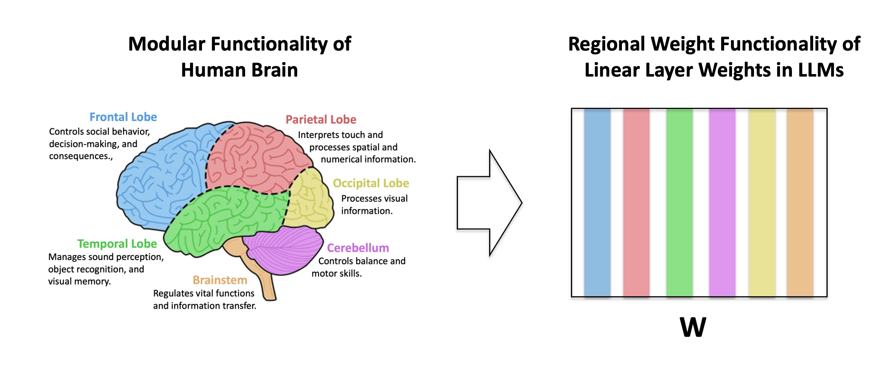
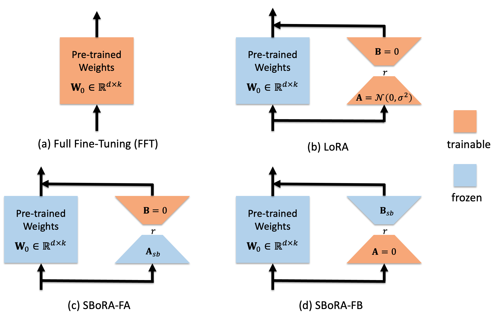
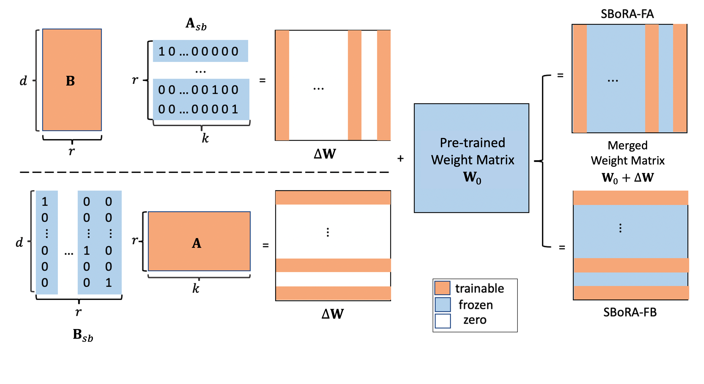

# SBoRA: Low-Rank Adaptation with Regional Weight Updates

|[Paper]()

This repo supports the paper "SBoRA: Low-Rank Adaptation with Regional Weight Updates". Developed by members from City University of Hong Kong, CityUHK-AI Group.

<h1 align="center">
    
</h1>

# Overview

We introduces Standard Basis LoRA (SBoRA), a novel parameter-efficient fine-tuning approach for Large Language Models that builds upon the pioneering works of Low-Rank Adaptation (LoRA) and Orthogonal Adaptation. SBoRA further reduces the computational and memory requirements of LoRA while enhancing learning performance. By leveraging orthogonal standard basis vectors to initialize one of the low-rank matrices, either A or B, SBoRA enables regional weight updates and memory-efficient fine-tuning. This approach gives rise to two variants, SBoRA-FA and SBoRA-FB, where only one of the matrices is updated, resulting in a sparse update matrix with a majority of zero rows or columns. Consequently, the majority of the fine-tuned model's weights remain unchanged from the pre-trained weights. This characteristic of SBoRA, wherein regional weight updates occur, is reminiscent of the modular organization of the human brain, which efficiently adapts to new tasks. Our empirical results demonstrate the superiority of SBoRA-FA over LoRA in various fine-tuning tasks, including commonsense reasoning and arithmetic reasoning. Furthermore, we evaluate the effectiveness of QSBoRA on quantized LLaMA models of varying scales, highlighting its potential for efficient adaptation to new tasks.

    

    

    
 Figure 1. Caption 

    

# Useful Links

# Instruction
This repository contains three main components: Commonsense reasoning; Arithmetic reasoning and QSBoRA. Which correspond to the three experiemnts in our paper. Please visit each directory to find more details.

