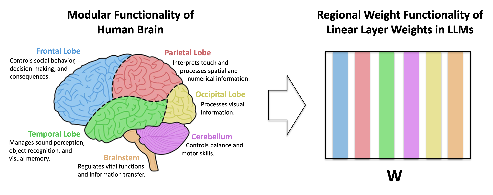

# SBoRA: Low-Rank Adaptation with Regional Weight Updates

|[Paper](https://arxiv.org/abs/2407.05413)

This repo supports the paper "SBoRA: Low-Rank Adaptation with Regional Weight Updates". Developed by Liu Yuyang from City University of Hong Kong, CityUHK-AI Group.

<h1 align="center">
    
</h1>

[Po Lai-Man](https://www.ee.cityu.edu.hk/~lmpo/), Liu Yuyang, Wu Haoxuan, Zhang Tianqi, Yu Wing-Yin, Jiang Zeyu, Li Kun
# Overview

We introduces Standard Basis LoRA (SBoRA), a novel parameter-efficient fine-tuning approach for Large Language Models that builds upon the pioneering works of Low-Rank Adaptation (LoRA) and Orthogonal Adaptation. SBoRA further reduces the computational and memory requirements of LoRA while enhancing learning performance. By leveraging orthogonal standard basis vectors to initialize one of the low-rank matrices, either A or B, SBoRA enables regional weight updates and memory-efficient fine-tuning. This approach gives rise to two variants, SBoRA-FA and SBoRA-FB, where only one of the matrices is updated, resulting in a sparse update matrix with a majority of zero rows or columns. Consequently, the majority of the fine-tuned model's weights remain unchanged from the pre-trained weights. This characteristic of SBoRA, wherein regional weight updates occur, is reminiscent of the modular organization of the human brain, which efficiently adapts to new tasks. Our empirical results demonstrate the superiority of SBoRA-FA over LoRA in various fine-tuning tasks, including commonsense reasoning and arithmetic reasoning. Furthermore, we evaluate the effectiveness of QSBoRA on quantized LLaMA models of varying scales, highlighting its potential for efficient adaptation to new tasks.

<h6 align="center">
    
     
    Four fine-tuning strategies
</h6>
<h6 align="center">
    
     
    Regional weight update process of SBoRA, showcasing distinct $\mathbf{W}_{0}+\mathrm{\Delta}\mathbf{W}$ computing procedures of SBoRA-FA(upper) and SBoRA-FB(lower). The diagram employs different colors to represent frozen, trainable, and zero parameters.
</h6>

# Instruction
This repository contains three main components: **Commonsense_reasoning**; **Arithmetic_reasoning** and **QSBoRA**. Which correspond to the three experiemnts in our paper. Please visit each directory to find more details.

# Experiments results
## Commonsense reasoning task
| Model / Method| r | TP |  BoolQ  |  PIQA  |  SIQA  |  HellaSwag  |  WinoGrande  |  ARC-e  |  ARC-c  |  OBQA  |  Average  |
|----------|---|----|---------|--------|--------|-------------|--------------|---------|---------|--------|-----------|
|LLaMA-7B / LoRA  | 32 | 56.1M | 66.8 | 81.1 | 78.4 | 53.5 | 80.5 | 81.1 | 61.9 | 79.4 | **72.8** |
|LLaMA-7B / DoRA  | 32 | 57.0M | 68.8 | 82.0 | 70.6 | 57.6 | 73.2 | 79.4 | 64.2 | 78.2 | 71.7     |
|LLaMA-7B / SBoRA-FA | 32 | 28.0M | 68.0 | 79.7 | 76.2 | 54.4 | 79.1 | 79.8 | 61.3 | 75.0 | 71.7 |
|LLaMA-7B / SBoRA-FB | 32 | 28.0M | 66.1 | 64.2 | 74.8 | 57.2 | 71.5 | 80.4 | 62.4 | 75.8 | 64.9 |
|LLaMA-7B / LoRA   | 64 | 112.M | 62.1 | 81.8 | 78.2 | 62.9 | 78.6 | 79.8 | 63.7 | 81.2 | 73.5   |
|LLaMA-7B / DoRA   | 64 | 113.1M | 68.7 | 82.8 | 78.2 | 64.8 | 62.9 | 79.7 | 64.8 | 80.0 | 72.7  |
|LLaMA-7B / SBoRA-FA  | 64 | 56.1M | 68.2 | 81.3 | 77.6 | 74.7 | 81.1 | 80.8 | 62.8 | 79.4 | **75.7** |
|LLaMA-7B / SBoRA-FB  | 64 | 56.1M | 66.5 | 79.2 | 76.7 | 59.2 | 76.5 | 76.8 | 59.0 | 74.4 | 71.0 |
|LLaMA3-8B / LoRA | 32 | 56.6M | 71.9 | 86.7 | 80.4 | 94.0 | 85.6 | 87.8 | 75.9 | 83.6 | 83.2 |
|LLaMA3-8B / DoRA | 32 | 57.4M | 73.6 | 87.1 | 80.8 | 94.4 | 86.1 | 88.8 | 78.3 | 84.2 | 84.2 |
|LLaMA3-8B / SBoRA-FA | 32 | 25.2M | 73.3 | 87.8 | 79.1 | 93.9 | 85.2 | 89.9 | 80.0 | 86.0 | **84.4** |
|LLaMA3-8B / SBoRA-FB | 32 | 31.5M | 72.9 | 86.3 | 78.8 | 92.6 | 83.0 | 88.8 | 76.3 | 85.0 | 83.0 |
|LLaMA3-8B / LoRA | 64 | 113.2M | 72.5 | 87.8 | 80.3 | 94.4 | 86.4 | 88.7 | 79.3 | 85.2 | 84.3 |
|LLaMA3-8B / DoRA | 64 | 114.0M | 70.5 | 86.0 | 80.3 | 91.8 | 83.7 | 86.2 | 74.7 | 83.2 | 82.1 |
|LLaMA3-8B / SBoRA-FA | 64 | 50.3M | 74.0 | 88.3 | 80.8 | 94.3 | 86.3 | 89.9 | 78.7 | 86.6 | **84.9** |
|LLaMA3-8B / SBoRA-FB | 64 | 62.9M | 71.8 | 85.2 | 79.2 | 91.4 | 82.9 | 86.7 | 74.0 | 83.4 | 81.8 |

## Arithmetic reasoning task
| Model / Method | r | TP | MultiArith | GSM8K | AddSub | AQuA | SingleEq | SVAMP | Average |
|----------------|---|----|------------|-------|--------|------|----------|-------|---------|
|LLaMA-7B / LoRA | 32 | 56.1M | 94.5 | 36.3 | 81.8 | 15.0 | 82.7 | 45.6 | **59.3** |
|LLaMA-7B / DoRA | 32 | 57.4M | 95.7 | 36.2 | 78.7 | 15.4 | 81.7 | 46.6 | 59.1 | 
|LLaMA-7B / SBoRA-FA | 32 | 28.0M | 95.5 | 34.6 | 79.7 | 20.1 | 78.9 | 44.8 | 58.9 |
|LLaMA-7B / SBoRA-FB | 32 | 28.0M | 92.2 | 31.0 | 77.5 | 15.7 | 78.5 | 41.8 | 56.1 |
|LLaMA-7B / LoRA | 64 | 112.2M | 94.0M | 36.8 | 84.3 | 17.3 | 82.3 | 44.7 | 59.9 |
|LLaMA-7B / DoRA | 64 | 113.1M | 95.0M | 35.5 | 84.1 | 20.1 | 85.0 | 47.1 | 61.1 |
|LLaMA-7B / SBoRA-FA | 64 | 56.1M | 97.8 | 36.6 | 85.1 | 19.3 | 83.9 | 48.5 | **61.9** |
|LLaMA-7B / SBoRA-FB | 64 | 56.1M | 94.8 | 33.1 | 77.5 | 16.9 | 78.5 | 40.6 | 56.9 |
|LLaMA3-8B / LoRA | 32 | 56.6M | 68.3 | 50.5 | 83.3 | 35.8 | 87.2 | 71.2 | 66.1 |
|LLaMA3-8B / DoRA | 32 | 57.4M | 97.3 | 62.0 | 90.9 | 25.6 | 94.9 | 73.4 | 74.0 |
|LLaMA3-8B / SBoRA-FA | 32 | 25.2M | 99.5 | 66.0 | 91.9 | 30.3 | 97.4 | 75.8 | **76.8** |
|LLaMA3-8B / SBoRA-FB | 32 | 31.5M | 98.0 | 57.2 | 92.2 | 33.9 | 94.1 | 69.6 | 74.2 |
|LLaMA3-8B / LoRA | 64 | 113.2M | 97.2 | 56.3 | 92.7 | 22.8 | 92.3 | 69.3 | 71.8 |
|LLaMA3-8B / DoRA | 64 | 114.0M | 97.8 | 55.2 | 91.1 | 24.0 | 94.7 | 72.0 | 72.5 |
|LLaMA3-8B / SBoRA-FA | 64 | 50.3M | 99.2 | 64.7 | 94.4 | 24.8 | 98.0 | 75.0 | **76.0** |
|LLaMA3-8B / SBoRA-FB | 64 | 62.9M | 98.2 | 50.9 | 87.1 | 28.0 | 91.7 | 63.0 | 69.8 |

## QSBoRA on MMLU bechmarks
| Model / Method | TP | Alpaca | Flanv2 |
|----------------|----|--------|--------|
|LLaMA-7B / QLoRA | 80.0M | 37.9 | **44.4** |
|LLaMA-7B / QDoRA | 80.6M | **38.0** | 42.8 |
|LLaMA-7B / QSBoRA-FA | 43.5M | 36.5 | 43.1 |
|LLaMA-7B / QSBoRA-FB | 36.4M | 36.9 | 43.4 |
|LLaMA-13B / QLoRA | 125.2M | 45.4 | 46.7 |
|LLaMA-13B / QDoRA | 126.2M | 46.7 | 48.8 |
|LLaMA-13B / QSBoRA-FA | 68.2M | **49.0** | **51.0** |
|LLaMA-13B / QSBoRA-FB | 57.0M | 48.3 | 50.5 |
|LLaMA3-8B / QLoRA | 83.9M | 51.9 | 49.5 |
|LLaMA3-8B / QDoRA | 84.6M | 53.0 | 51.9 |
|LLaMA3-8B / QSBoRA-FA | 44.0M | **56.5** | **56.4** |
|LLaMA3-8B / QSBoRA-FB | 39.8M | 54.5 | 55.0 |

# SBoRA diffusion fine-tuning results
Qualitative comparison of single-concept SBoRA diffusion model image generation. Reference images for each concept is shown in the left column. LoRA-based method outperforms Custom Diffusion in terms of fidelity. Furthermore, Orthogonal Adaptation and SBoRA exhibit comparable performance to Mix-of-show, while also introducing orthogonal constraints that confer advantages in multi-concept scenarios. 
<h1 align="center">
    
</h1>
Quantitative comparison result of SBoRA single concept tuning of image generation in diffusion model. Previous methods have exhibited varying performance across different concepts or metrics. Custom Diffusion, for instance, proves to be less effective in preserving image alignment, whereas Mix-of-show and Orthogonal Adaptation encounter challenges in maintaining text alignment. In contrast, our proposed method achieves comparable performance and results, demonstrating a more stable score across all concepts and metrics. 

## Text Alignment
| Method | Character | Object | Mean |
|--------|-----------|--------|------|
| Custome Diffusion | 0.7893 | 0.7892 | 0.7893|
| Mix-of_show | 0.7100 | 0.6487 | 0.6793 |
| Orthogonal Adaptation | 0.7230 | 0.6635 | 0.6932 |
| SBoRA-FA | 0.7437 | 0.6773 | 0.7105 |
| SBoRA-FB | 0.7423 | 0.6929 | 0.7176 |

## Image Alignment
| Method | Character | Object | Mean |
|--------|-----------|--------|------|
| Custome Diffusion | 0.6223 | 0.7098 | 0.6661 |
| Mix-of_show | 0.7081 | 0.7977 | 0.7529 |
| Orthogonal Adaptation | 0.7150 | 0.7887 | 0.7518 |
| SBoRA-FA | 0.7058 | 0.7851 | 0.7454 |
| SBoRA-FB | 0.6910 | 0.7676 | 0.7293 |

# Contact
Po Lai-Man: eelmpo@cityu.edu.hk; Liu Yuyang: yuyangliu5-c@my.cityu.edu.hk; Wu Haoxuan: haoxuanwu2-c@my.cityu.edu.hk

